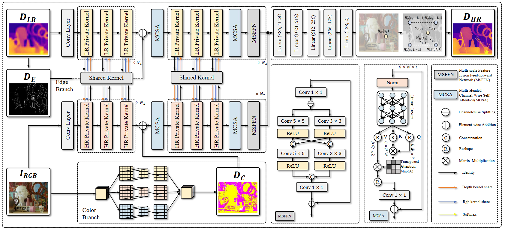

# Dual Prior Guided Depth Image Super-Resolution with Multi-Scale Transformer Fusion Networ

Pengfei Zhao, Jianhua Ji, Yang Wen, Wuzhen Shi, WenmingCao

## **Overview**

---



## **Getting Started**

---

1. Clone repo

```jsx
git clone https://github.com/CavanMilk/DPGD.git
cd DPGD
```

1. Create and activate a new conda environment

```jsx
conda create -n DPGD python=3.9.13
conda activate DPGD
```

1. Install dependent packages

```jsx
pip install --upgrade pip
pip install -r requirements.txt
```

## **Data Preparation**

---

Please see [data/prepare_data.md](https://github.com/CavanMilk/DPGD/blob/main/data/prepare_data.md) for the details.

## **Training&Testing**

---

You can use the provided scripts (`scripts/train*`) to train models.

For example:

```jsx
OMP_NUM_THREADS=8 CUDA_VISIBLE_DEVICES=2 python main.py --name jiif_4 --model JIIF --scale 4 --sample_q 30720 --input_size 256 --train_batch 1 --epoch 200 --eval_interval 10 --lr 0.0001 --lr_step 60 --lr_gamma 0.2
```

```jsx
OMP_NUM_THREADS=8 CUDA_VISIBLE_DEVICES=1 python main.py --test --checkpoint best --name jiif_4 --model JIIF --dataset Middlebury --scale 4 --interpolation bicubic --data_root ./data/depth_enhance/01_Middlebury_Dataset
```

## **Acknowledgment**

---

This project is  based on [Jiif](https://github.com/ashawkey/jiif).